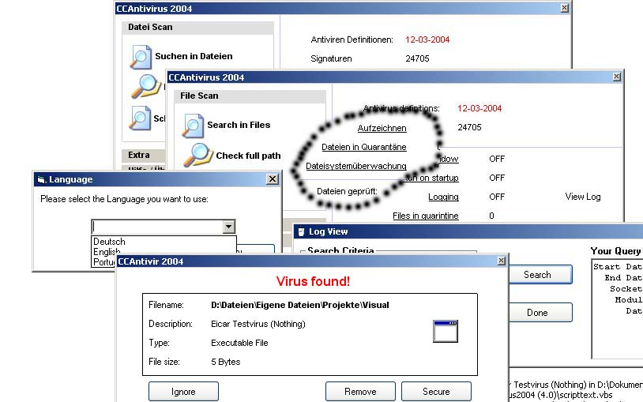



## CC Anti Virus 2004 \(4\.1 Bug fixed\)

### Description

Completely working Anti Virus program. Big updates: Added possibility to scan for Virus specific strings. That means the software is able to find Viruses that infect other files. Another big improvement: AFM – Active File system Monitoring: The software scans automatically the Directory you’re browsing with the Explorer. The interface is now multilingual (Currently supporting English, German, and Portuguese). Added sound notification to Alert Box. Added Advanced Errorhandling. A lot of smaller bugs fixed (update problem). Online Signature File now includes 24.000 Signatures. Added a helpsystem. ***NOTE: For testing the AFM I've added the String 'Eicar' to the DB. You can write this string into a Text file and rename it to .com or .exe. Then execute my Program and browse with the explorer to the directory that contains the file and wait a few seconds***
 
### More Info
 

             |
---                |---
**Submitted On**   |2004-05-01 17:02:14
**By**             |[Cyber Chris](https://github.com/Planet-Source-Code/PSCIndex/blob/master/ByAuthor/cyber-chris.md)
**Level**          |Advanced
**User Rating**    |5.0 (189 globes from 38 users)
**Compatibility**  |VB 3\.0, VB 4\.0 \(16\-bit\), VB 4\.0 \(32\-bit\), VB 5\.0, VB 6\.0
**Category**       |[Complete Applications](https://github.com/Planet-Source-Code/PSCIndex/blob/master/ByCategory/complete-applications__1-27.md)
**World**          |[Visual Basic](https://github.com/Planet-Source-Code/PSCIndex/blob/master/ByWorld/visual-basic.md)
**Archive File**   |[CC\_Anti\_Vi173971522004\.zip](https://github.com/Planet-Source-Code/cyber-chris-cc-anti-virus-2004-4-1-bug-fixed__1-53497/archive/master.zip)

